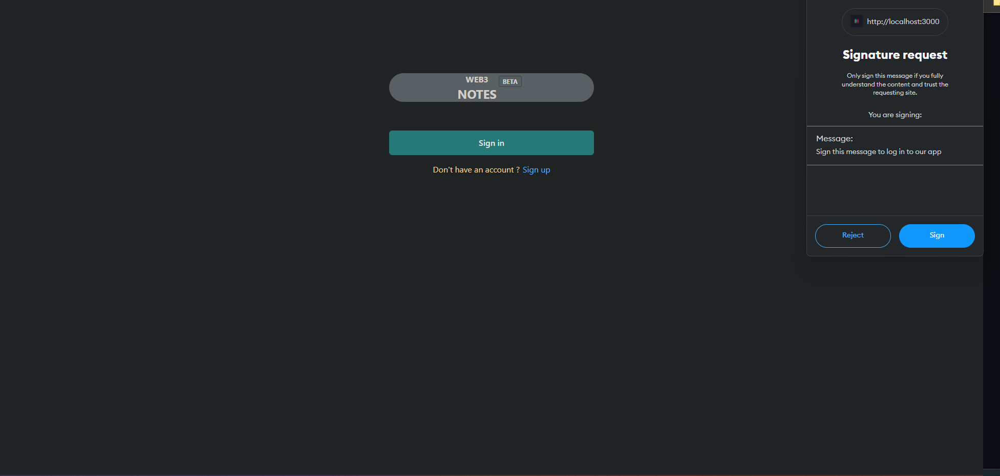
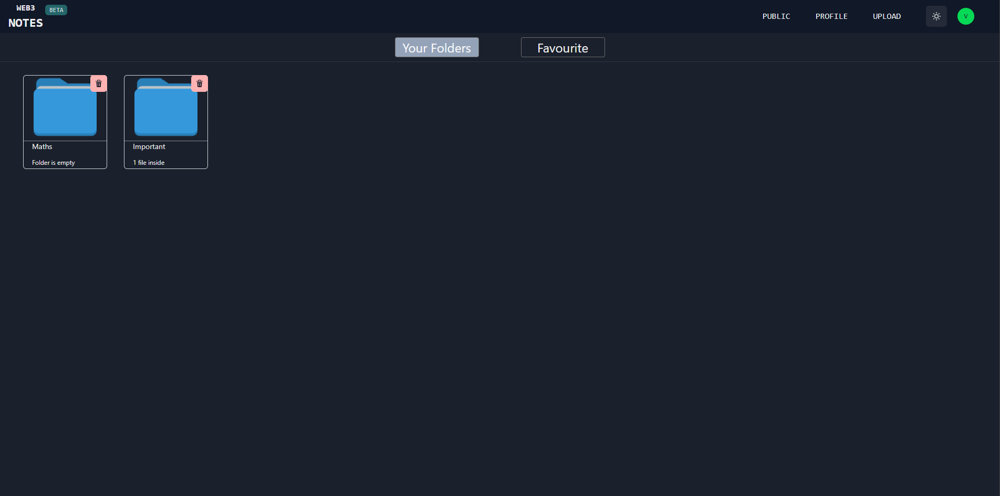
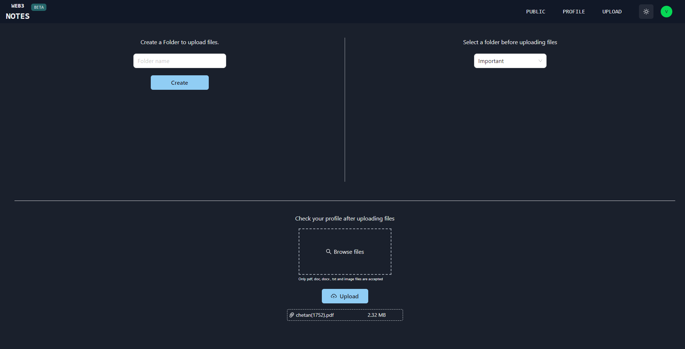
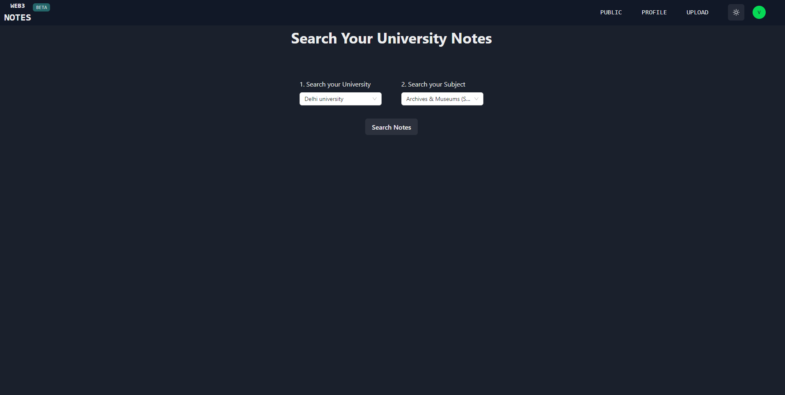

# 👋 Web3 Notes

<hr/>

<br/>

- Web3 Notes is a decentralized notes storing dapp, build on Spheron.

- user can upload there notes in form of Pdf, txt , img files <br/>

- User control all their notes and store them securely on a decentralized network that's always online.<br/>
  <br/>

# 🔥 Features

- User can easily login with metamask

   <br/>

- Users can create folders just like google drive , and then upload notes in different folders.
  it help them to keep notes according to their need.

   <br/>

- User can Easy upload notes in folder

   <br/>

- User can search for Public notes which was uploaded by admin and then add them to favourites

   <br/>

# ⚙️ Technology

- React.js , which is hosted Spheron Decentralized Hosting.
- Decentralized Nodejs and Express.js
- Polybase web3 database (schema created with polybase explorer)
- Spheron Storage SDK to Upload notes on Decentralized storage.

<hr/>

# 🔨 Get Started

<hr/>
<br/>

## NOTE-> Install metamask in browser to avoid errors

- Live demo not working properly because of cors error, i purchaseda custom domain but error was not solved
- Due to final year exams i was not able to debug this cors error.

## Links

### Youtube demo video -> [Click here](https://www.youtube.com/watch?v=nL_3tIjX9-k)

### [Live Demo](https://web3-frontend-fd09a5.spheron.app/)

### [Api Demo](http://provider.palmito.duckdns.org:32748/)

### Custom domain for api : https://web3-notes.live/

<br/>

## This product contain client and server

<br/>

## - Client

<br/>

1. &nbsp; Clone this repository

&nbsp; `git clone https://github.com/ChetanXpro/web3-notes.git`

&nbsp; ` cd client`

&nbsp; `npm install`

2. Run React.js app

&nbsp; `npm run dev`

## - Server

1. &nbsp; Clone this repository

&nbsp; `git clone https://github.com/ChetanXpro/web3-notes.git`

&nbsp; ` cd server`

&nbsp; `npm install`

2. &nbsp; Add .env file

```
ACCESS_TOKEN_SECRET=<A random string>
SPHERON_TOKEN=<YOUR SPHERON TOKEN>
POLYBASE_NAMESPACE=<YOUR polybase-namespace >
PRIVATE_KEY=<your private key to intereact with polybase>
```

3. Run Server app

&nbsp; `npm run dev`
